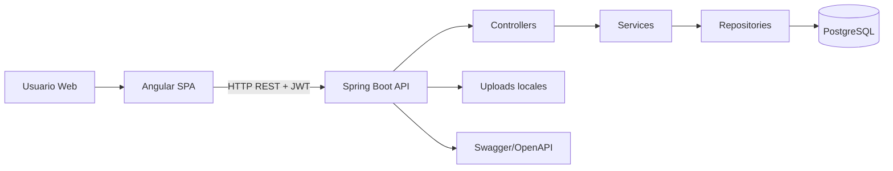
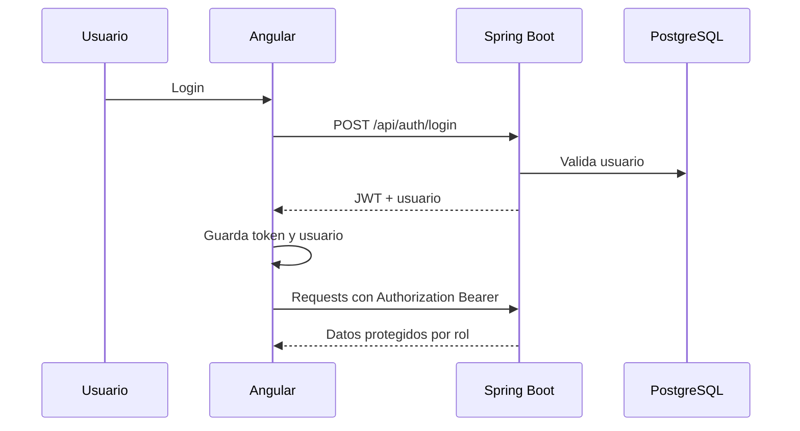
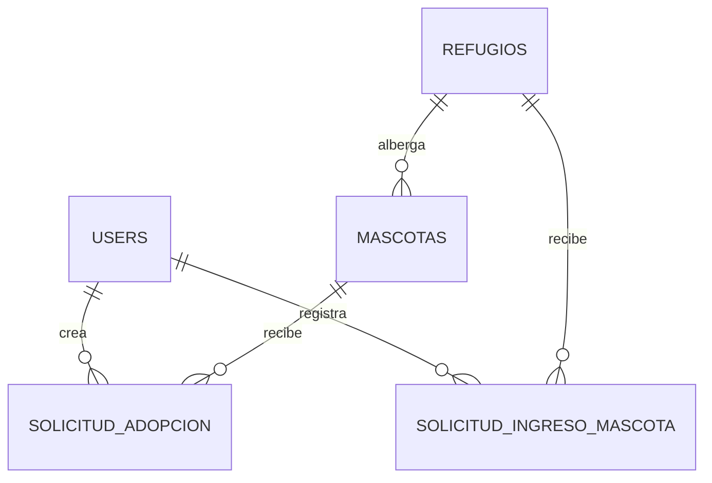

# GAIA

GAIA es una plataforma web full stack para la gestión de adopciones, refugios, mascotas y solicitudes de ingreso de animales en Neiva, Huila, Colombia. El sistema integra un frontend Angular, un backend Spring Boot con seguridad JWT y una base de datos PostgreSQL para centralizar procesos operativos de refugios y facilitar la adopción responsable.

## Descripción General

GAIA aborda la dispersión de información sobre mascotas disponibles, refugios, solicitudes de adopción y casos de entrega responsable. La solución permite que usuarios registren solicitudes, consulten mascotas y administren su perfil, mientras que administradores gestionan inventario, refugios, usuarios, aprobaciones, rechazos, imágenes y métricas operativas.

El impacto social esperado es mejorar la visibilidad de animales en adopción, reducir tiempos de gestión administrativa, ordenar la comunicación entre ciudadanos y refugios, y fortalecer la trazabilidad de las decisiones de adopción e ingreso.

## Características Principales

- Autenticación y autorización con JWT.
- Roles `ROLE_USER` y `ROLE_ADMIN`.
- Registro, login, cierre de sesión y persistencia local de sesión.
- Listado, detalle, filtros y administración de mascotas.
- CRUD administrativo de mascotas, refugios y usuarios.
- Solicitudes de adopción con aprobación, rechazo y eliminación.
- Solicitudes de ingreso de mascotas con carga multipart de imágenes.
- Perfil de usuario y perfil administrativo.
- Dashboard administrativo con indicadores operativos.
- Mapa de refugios con Leaflet y geolocalización.
- Carga, validación, persistencia y visualización de imágenes.
- Guards, interceptors, timeout HTTP, manejo centralizado de errores y notificaciones toast.
- Diseño responsive con UI minimalista, tarjetas modernas, skeleton loaders y estados vacíos.

## Arquitectura

GAIA usa una arquitectura cliente-servidor con separación clara entre presentación, API REST, lógica de negocio, persistencia y seguridad.



### Frontend

- Angular standalone components.
- Routing con lazy loading.
- Guards para rutas autenticadas y administrativas.
- Interceptors para JWT, errores, timeout y redirección por sesión expirada.
- Servicios por dominio: autenticación, mascotas, refugios, usuarios, dashboard, adopciones, ingresos y uploads.

### Backend

- Spring Boot con Spring Web MVC.
- Spring Security stateless con JWT.
- Servicios transaccionales por caso de uso.
- DTOs para entrada/salida.
- Mappers para aislar entidades de respuestas REST.
- Validaciones Jakarta Validation.
- Flyway para migraciones.

### Base de Datos

PostgreSQL almacena usuarios, roles, refugios, mascotas, solicitudes de adopción y solicitudes de ingreso. Las imágenes se guardan como archivos en `uploads/` y la base de datos conserva la URL pública.

### Flujo de Comunicación



## Tecnologías Utilizadas

- Angular 21
- TypeScript 5.9
- RxJS
- Bootstrap 5
- Font Awesome
- Leaflet
- ngx-toastr
- Spring Boot 4
- Java 21
- Spring Security
- JWT
- Spring Data JPA
- Hibernate
- PostgreSQL
- Flyway
- Swagger/OpenAPI
- Maven

## Requisitos Previos

- Java 21
- Node.js y NPM
- PostgreSQL
- Git
- Maven o wrapper incluido (`mvnw.cmd`)

## Instalación Completa

### Base de Datos

Crear la base de datos:

```sql
CREATE DATABASE gaia;
```

Usuario recomendado para desarrollo:

```sql
CREATE USER gaia_user WITH PASSWORD 'gaia_password';
GRANT ALL PRIVILEGES ON DATABASE gaia TO gaia_user;
```

Si se usa el usuario por defecto del proyecto, validar las credenciales en `backend/src/main/resources/application.properties`.

### Backend

```bash
cd backend
mvnw.cmd clean install
```

Variables principales:

```bash
SERVER_PORT=8443
SSL_ENABLED=true
SSL_KEY_STORE=classpath:gaia.p12
SSL_KEY_STORE_PASSWORD=gaia-local-dev-ssl
SSL_KEY_STORE_TYPE=PKCS12
SSL_KEY_ALIAS=gaia
DB_URL=jdbc:postgresql://localhost:5432/gaia
DB_USERNAME=postgres
DB_PASSWORD=1077
JWT_SECRET=gaia-jwt-secret-change-this-value-in-production-2026
JWT_EXPIRATION_MS=86400000
CORS_ALLOWED_ORIGINS=http://localhost:4200,https://localhost:4200
UPLOAD_DIR=uploads
PUBLIC_BASE_URL=https://localhost:8443
```

Ejecutar:

```bash
mvnw.cmd spring-boot:run
```

### Frontend

```bash
cd frontend
npm install
npm run build
npm start
```

URL local:

```text
http://localhost:4200
```

### Scripts del Proyecto

Desde la raíz:

```bash
scripts\run-backend.cmd
scripts\run-frontend.cmd
scripts\run-project.cmd
```

## Ejecución Local

- Backend HTTPS: `https://localhost:8443`
- Frontend: `http://localhost:4200`
- Swagger: `https://localhost:8443/swagger-ui/index.html`
- API Docs: `https://localhost:8443/v3/api-docs`
- Archivos subidos: `https://localhost:8443/uploads/{archivo}`

## HTTPS Local

El backend usa HTTPS con un keystore PKCS12 local ubicado en:

```text
backend/src/main/resources/gaia.p12
```

Configuración activa:

```properties
server.port=${SERVER_PORT:8443}
server.ssl.enabled=${SSL_ENABLED:true}
server.ssl.key-store=${SSL_KEY_STORE:classpath:gaia.p12}
server.ssl.key-store-password=${SSL_KEY_STORE_PASSWORD:gaia-local-dev-ssl}
server.ssl.key-store-type=${SSL_KEY_STORE_TYPE:PKCS12}
server.ssl.key-alias=${SSL_KEY_ALIAS:gaia}
app.public-base-url=${PUBLIC_BASE_URL:https://localhost:8443}
```

Regenerar el certificado local:

```bash
cd backend
keytool -genkeypair -alias gaia -keyalg RSA -keysize 2048 -storetype PKCS12 -keystore src/main/resources/gaia.p12 -validity 3650
```

Comando no interactivo usado en desarrollo:

```bash
keytool -genkeypair -alias gaia -keyalg RSA -keysize 2048 -storetype PKCS12 -keystore src/main/resources/gaia.p12 -validity 3650 -storepass gaia-local-dev-ssl -keypass gaia-local-dev-ssl -dname "CN=localhost, OU=GAIA Development, O=GAIA, L=Neiva, ST=Huila, C=CO" -ext "SAN=dns:localhost,ip:127.0.0.1,ip:::1" -noprompt
```

## Variables de Entorno

| Variable | Descripción | Ejemplo |
|---|---|---|
| `SERVER_PORT` | Puerto HTTPS del backend | `8443` |
| `SSL_ENABLED` | Activa TLS en Tomcat embedded | `true` |
| `SSL_KEY_STORE` | Ubicación del keystore | `classpath:gaia.p12` |
| `SSL_KEY_STORE_PASSWORD` | Password del keystore | `gaia-local-dev-ssl` |
| `SSL_KEY_STORE_TYPE` | Tipo de almacén | `PKCS12` |
| `SSL_KEY_ALIAS` | Alias del certificado | `gaia` |
| `DB_URL` | URL JDBC de PostgreSQL | `jdbc:postgresql://localhost:5432/gaia` |
| `DB_USERNAME` | Usuario de PostgreSQL | `postgres` |
| `DB_PASSWORD` | Contraseña de PostgreSQL | `1077` |
| `JWT_SECRET` | Secreto de firma JWT | `change-me` |
| `JWT_EXPIRATION_MS` | Duración del token | `86400000` |
| `CORS_ALLOWED_ORIGINS` | Orígenes permitidos | `http://localhost:4200,https://localhost:4200` |
| `UPLOAD_DIR` | Carpeta de imágenes | `uploads` |
| `PUBLIC_BASE_URL` | URL pública backend | `https://localhost:8443` |
| `FLYWAY_ENABLED` | Activa migraciones | `true` |
| `JPA_DDL_AUTO` | Modo Hibernate | `update` |

Frontend:

```ts
export const environment = {
  production: false,
  apiUrl: 'https://localhost:8443/api',
  httpTimeoutMs: 30000
};
```

## Estructura del Proyecto

```text
gaia/
├── backend/
│   ├── src/main/java/com/gaia/
│   │   ├── config/
│   │   ├── controller/
│   │   ├── dto/
│   │   ├── entity/
│   │   ├── exception/
│   │   ├── mapper/
│   │   ├── repository/
│   │   ├── security/
│   │   └── service/
│   ├── src/main/resources/
│   │   ├── application.properties
│   │   └── db/migration/
│   └── pom.xml
├── frontend/
│   ├── src/app/
│   │   ├── components/
│   │   ├── guards/
│   │   ├── interceptors/
│   │   ├── layouts/
│   │   ├── models/
│   │   ├── pages/
│   │   ├── pipes/
│   │   ├── services/
│   │   └── shared/
│   ├── src/assets/
│   ├── src/environments/
│   ├── angular.json
│   └── package.json
├── postman/
├── scripts/
├── uploads/
└── README.md
```

## Base de Datos

### Modelo Relacional



### Entidades

- `User`: datos personales, email, contraseña cifrada, teléfono, foto y rol.
- `Refugio`: nombre, dirección, teléfono, ciudad, descripción, latitud y longitud.
- `Mascota`: datos de adopción, salud, imagen, disponibilidad y refugio asociado.
- `SolicitudAdopcion`: relación usuario-mascota, mensaje, estado y fecha.
- `SolicitudIngresoMascota`: datos de mascota entregada por usuario, imagen, contacto, refugio y estado.

### Estados

Solicitudes:

- `PENDIENTE`
- `APROBADA`
- `RECHAZADA`

Tamaño mascota:

- `PEQUENO`
- `MEDIANO`
- `GRANDE`

Tipo edad:

- `MESES`
- `ANIOS`

## API REST

Base URL:

```text
https://localhost:8443/api
```

### Auth

| Método | Endpoint | Descripción |
|---|---|---|
| `POST` | `/auth/register` | Registrar usuario |
| `POST` | `/auth/login` | Iniciar sesión |

Ejemplo login:

```json
{
  "email": "admin@gaia.com",
  "password": "password123"
}
```

Respuesta:

```json
{
  "token": "jwt-token",
  "tokenType": "Bearer",
  "usuario": {
    "id": 1,
    "nombre": "Admin",
    "apellido": "GAIA",
    "email": "admin@gaia.com",
    "role": "ROLE_ADMIN"
  }
}
```

### Mascotas

| Método | Endpoint | Rol |
|---|---|---|
| `GET` | `/mascotas` | Público |
| `GET` | `/mascotas/{id}` | Público |
| `POST` | `/mascotas` | Admin |
| `PUT` | `/mascotas/{id}` | Admin |
| `DELETE` | `/mascotas/{id}` | Admin |

Filtros:

```text
/api/mascotas?raza=Labrador&tamano=MEDIANO&genero=MACHO&disponible=true
```

### Refugios

| Método | Endpoint | Rol |
|---|---|---|
| `GET` | `/refugios` | Público |
| `GET` | `/refugios/{id}` | Público |
| `POST` | `/refugios` | Admin |
| `PUT` | `/refugios/{id}` | Admin |
| `DELETE` | `/refugios/{id}` | Admin |

### Solicitudes de Adopción

| Método | Endpoint | Rol |
|---|---|---|
| `POST` | `/adopciones` | Usuario |
| `GET` | `/adopciones` | Usuario/Admin |
| `PUT` | `/adopciones/{id}/estado` | Admin |
| `DELETE` | `/adopciones/{id}` | Admin |

Ejemplo:

```json
{
  "mascotaId": 3,
  "mensaje": "Deseo adoptar esta mascota y cuento con un hogar adecuado."
}
```

### Solicitudes de Ingreso

| Método | Endpoint | Rol |
|---|---|---|
| `POST` | `/ingresos-mascotas` | Usuario |
| `GET` | `/ingresos-mascotas` | Usuario/Admin |
| `PUT` | `/ingresos-mascotas/{id}/estado` | Admin |
| `DELETE` | `/ingresos-mascotas/{id}` | Admin |

El registro usa `multipart/form-data` e incluye:

```text
nombreMascota, edad, tipoEdad, raza, tamano, genero, descripcion,
estadoSalud, vacunado, esterilizado, motivoEntrega, telefonoContacto,
direccion, refugioId, imagen
```

### Usuarios

| Método | Endpoint | Rol |
|---|---|---|
| `GET` | `/users/me` | Usuario/Admin |
| `PUT` | `/users/me` | Usuario/Admin |
| `GET` | `/users` | Admin |
| `PUT` | `/users/{id}/role` | Admin |
| `DELETE` | `/users/{id}` | Admin |

### Dashboard

| Método | Endpoint | Rol |
|---|---|---|
| `GET` | `/admin/dashboard` | Admin |
| `GET` | `/admin/dashboard/total-mascotas` | Admin |
| `GET` | `/admin/dashboard/total-usuarios` | Admin |
| `GET` | `/admin/dashboard/solicitudes-pendientes` | Admin |
| `GET` | `/admin/dashboard/mascotas-disponibles` | Admin |

### Uploads

| Método | Endpoint | Rol |
|---|---|---|
| `POST` | `/uploads/images` | Usuario/Admin |

Campo multipart:

```text
file
```

Respuesta:

```json
{
  "fileName": "imagen-uuid.jpg",
  "url": "https://localhost:8443/uploads/imagen-uuid.jpg"
}
```

## Seguridad

- JWT enviado en `Authorization: Bearer {token}`.
- Backend stateless sin sesiones HTTP.
- Contraseñas cifradas con BCrypt.
- Rutas públicas: auth, mascotas GET, refugios GET, Swagger y uploads públicos.
- Rutas autenticadas: perfil, solicitudes, entrega de mascotas y carga de imágenes.
- Rutas administrativas: dashboard, CRUD de mascotas, refugios, usuarios y aprobación/rechazo de solicitudes.
- Guards Angular: `authGuard` y `adminGuard`.
- Interceptors Angular: token JWT, timeout HTTP, manejo de 401/403/500 y notificaciones.

## Flujo Funcional

### Registro

1. Usuario completa formulario.
2. Frontend valida datos.
3. Backend crea usuario `ROLE_USER`.
4. Backend retorna JWT.
5. Frontend persiste sesión.

### Login

1. Usuario ingresa email y contraseña.
2. Backend autentica credenciales.
3. Frontend guarda token y usuario.
4. La navegación se redirige según rol o `returnUrl`.

### Adopción

1. Usuario consulta mascotas disponibles.
2. Abre detalle de mascota.
3. Envía solicitud de adopción.
4. Administrador aprueba o rechaza.
5. Si se aprueba, la mascota deja de estar disponible.

### Ingreso de Mascotas

1. Usuario diligencia datos de la mascota.
2. Selecciona imagen local.
3. Frontend valida tipo y tamaño.
4. Backend almacena imagen y solicitud.
5. Administrador aprueba, rechaza o elimina.
6. Si se aprueba, se crea una mascota disponible en el refugio.

### Administración

1. Admin ingresa al dashboard.
2. Consulta métricas y tablas.
3. Gestiona mascotas, refugios, usuarios y solicitudes.
4. Las operaciones se confirman visualmente y recargan datos.

## Capturas y Evidencias

Agregar capturas en esta sección:

```text
docs/screenshots/login.png
docs/screenshots/dashboard-admin.png
docs/screenshots/mascotas.png
docs/screenshots/refugios-mapa.png
docs/screenshots/perfil.png
```

## Solución de Problemas

### PowerShell no ejecuta npm

Usar:

```bash
npm.cmd install
npm.cmd run build
npm.cmd start
```

### Error CORS

Validar:

```bash
CORS_ALLOWED_ORIGINS=http://localhost:4200,https://localhost:4200
```

### Error de conexión PostgreSQL

Revisar:

```bash
DB_URL
DB_USERNAME
DB_PASSWORD
```

Confirmar que PostgreSQL esté activo y que exista la base de datos `gaia`.

### Imágenes no se visualizan

Validar:

```bash
UPLOAD_DIR=uploads
PUBLIC_BASE_URL=https://localhost:8443
```

Confirmar que el backend esté sirviendo `/uploads/**`.

### El navegador marca certificado no confiable

El certificado local es autofirmado. Abrir `https://localhost:8443`, aceptar el riesgo local del navegador y volver a cargar el frontend.

### Spring no encuentra el keystore

Confirmar:

```text
backend/src/main/resources/gaia.p12
server.ssl.key-store=classpath:gaia.p12
server.ssl.key-alias=gaia
```

Listar el contenido:

```bash
cd backend
keytool -list -keystore src/main/resources/gaia.p12 -storetype PKCS12 -storepass gaia-local-dev-ssl
```

### Sesión expirada

El frontend elimina la sesión local y redirige a `/login` cuando el backend responde `401`.

### Carga infinita

Los componentes usan `finalize()` y `catchError()` en operaciones HTTP para asegurar cierre de loaders en éxito, error o timeout.

## Roadmap

- Auditoría de accesibilidad WCAG.
- Panel de reportes exportables.
- Geolocalización avanzada por distancia.
- Notificaciones por correo.
- Historial de adopciones.
- Gestión documental de adoptantes.
- Pruebas E2E automatizadas.
- Despliegue con Docker Compose.
- Almacenamiento externo de imágenes compatible con S3.

## Contribución

1. Crear rama desde `main`.
2. Ejecutar pruebas y build antes de abrir cambios.
3. Mantener separación por capa: frontend, backend y base de datos.
4. Documentar endpoints nuevos.
5. Incluir migraciones Flyway cuando cambie el modelo.

## Licencia

Proyecto académico. Definir licencia institucional antes de distribución pública.

## Créditos

Autor: Proyecto académico GAIA  
Ciudad: Neiva, Huila, Colombia  
Área: Ingeniería de Software, Arquitectura Full Stack y Desarrollo Web Empresarial
